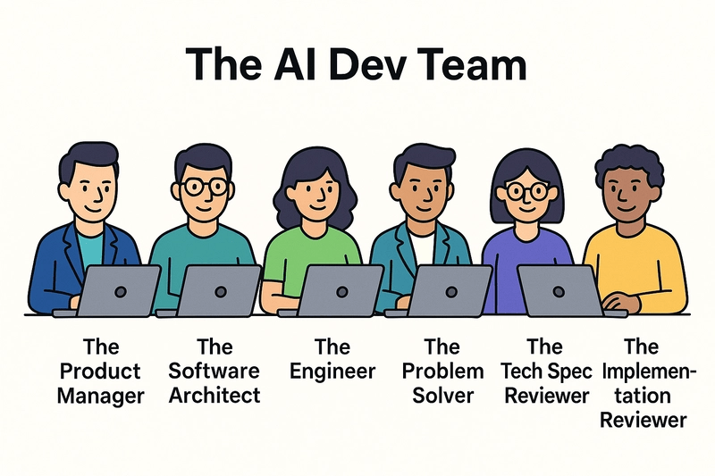

# Stunning-computing-machine

## Primary Objective

The primary objective of creating this repository is for experimenting by making self-contained development environments for insoucing by properly managing freelancers. 

This will be a framework for a web site that will provide Docker Containers for software development.

## Secondary Objective

The secondary objective is to see how to do scale up software development by means of AI/LLM Prompt engineering and Context engineering.

## Development Approach

This project is developed by using AI development team inspired by this article below:

[Reference: AI Development team article from dev.to](https://dev.to/this-is-learning/github-copilot-a-persona-based-approach-to-real-world-development-56ee?fbclid=IwY2xjawM8dztleHRuA2FlbQIxMQBicmlkETFJbnB5MllVUlBHRE44T2ttAR6Vo3pcghM2ZIT_lueDkcHrMkhWzQPT9YY1kK7I9FCDCRjqE5BPPvalCbbjUw_aem_DrbIbU_mdkUeC6Ac4H35zw)

## Links

To understand more about custom chatmodes can be read here
[Custom chatmodes in VS Code](https://code.visualstudio.com/docs/copilot/customization/custom-chat-modes)

Contents of Chatmodes in this repo are adapted from

[Copilot repo for chatmodes](https://github.com/dfinke/awesome-copilot-chatmodes)