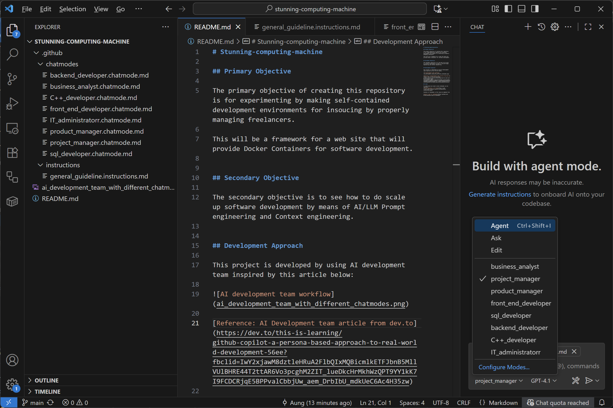
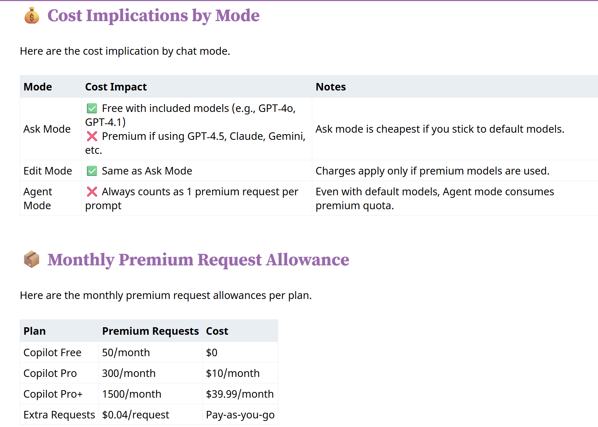
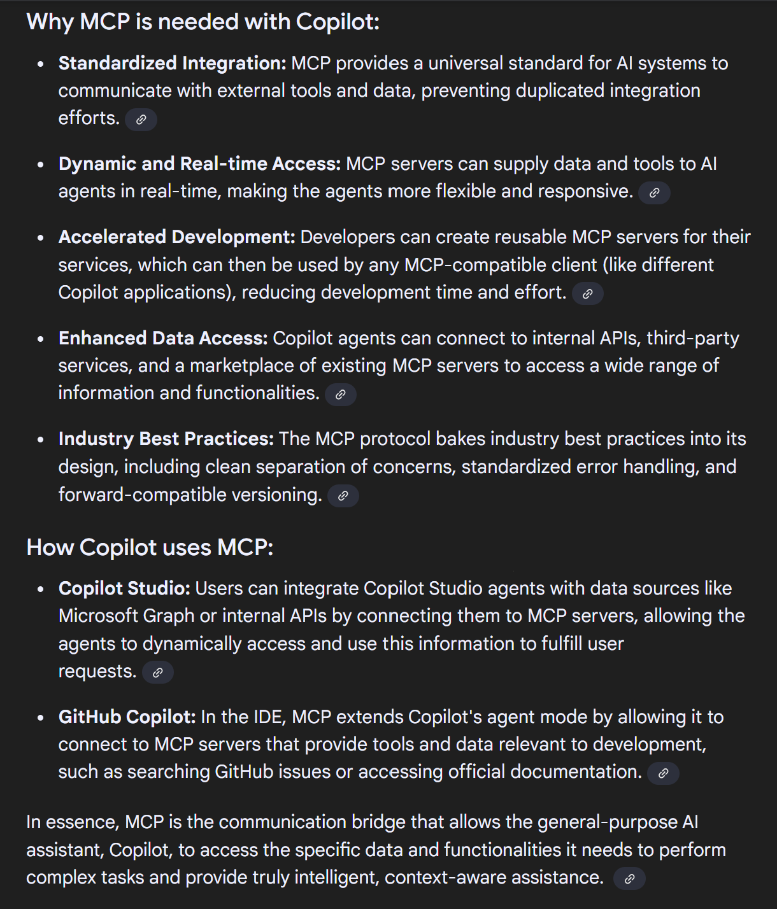

# Stunning-computing-machine

## Primary Objective

The primary objective of creating this repository is for experimenting by making self-contained development environments for in-soucing by properly managing freelancers and also by providing secure, intellectul property protecting development environment. 

This will be a framework for a web site that will provide Docker Containers for software development.

### Read Me file for primary objective
[README_Primary.md](README_Primary.md)

## Secondary Objective

The secondary objective of this repostry is to see how to do scale up software development by means of AI/LLM Prompt engineering and Context engineering by using custom chatmodes.

### What Is a Custom Chat Mode?
It’s essentially a user-defined configuration file (chatmode.md) that tells Copilot how to think, act, and respond. For example, you can create modes tailored for:

### AI Development Team Development Approach

This project is developed using AI Development team inspired by article below:

[Reference: AI Development team article from dev.to](https://dev.to/this-is-learning/github-copilot-a-persona-based-approach-to-real-world-development-56ee?fbclid=IwY2xjawM8dztleHRuA2FlbQIxMQBicmlkETFJbnB5MllVUlBHRE44T2ttAR6Vo3pcghM2ZIT_lueDkcHrMkhWzQPT9YY1kK7I9FCDCRjqE5BPPvalCbbjUw_aem_DrbIbU_mdkUeC6Ac4H35zw)

The benefit of that approach is that continual flow of prompting by just switching chatmodes as follows:

## How custom chatmodes are used

When you load a mode with a Focus section, Copilot interprets it as a high-level directive. For example:

### Focus
- Focus: C++ development with Modern C++ 11/14/17/20/23, STL, Boost, CMake, and performance optimization. Use Non-Boost ASIO for networking and filesystem. Use header-only libraries, Use RAII and smart pointers for memory management. Follow C++ best practices and idioms. Use Cppcheck, Clang-Tidy, and AddressSanitizer for static analysis and runtime checks. Write unit tests with Google Test or Catch2. Adhere to the C++ Core Guidelines.

This tells Github Copilot to use:

- Modern C++ standards
- Boost
- Non-Boost ASIO for Networking and FileSystems
- Use Header Only libraries 
- CMake Built System
- RAII for smart pointers

## $$$$ 

While this AI multiple persona based approach can be useful for you to serve as an AI team there are cost implications for using custom chatmodes especially in
Agent mode and not in Ask mode.

In other words, custom chatmodes could be costly if one were using VS Code and Github Copilot using personal license. See cost below:

Above cost breakdown info is from the reference below

[Modes of Chatting with GitHub Copilot by John Miller](https://www.codemag.com/Blog/AIPractitioner/GHCPCM)

### MCP Integration

MCP (Model Context Protocol) are USB-C or generalisd interface for interfacing AI models. Some MCP servers are using for some simple use cases such as CI/CD and beyond. See what Google AI answer for why MCP servers are useful in Copilot.

### MCP Instruction Files
If you're using MCP instruction files, you can reference specific chat modes within those workflows—making it seamless to switch personas mid-task.

[MCP Integrations with custom chatmodes in VS Code](https://www.codemag.com/Blog/AIPractitioner/GHCPCM)

#### MCP Servers

What are Must-Have MCP Servers for Coding and Beyond

Sequential Thinking MCP – Breaks down complex problems into manageable steps, enabling structured problem-solving. Ideal for system design planning, architectural decisions, and refactoring strategies.

Puppeteer MCP – Navigate websites, take screenshots, and interact with web pages. Makes a big difference in UI testing and automation.

Memory Bank MCP – A must-have for complex projects. Organizes project knowledge hierarchically, helping AI better understand your project’s structure and goals. This MCP automates the creation of a memory bank for your project.

Playwright MCP – Critical for cross-browser testing and advanced web automation. A modern, feature-rich alternative to Puppeteer.

GitHub MCP – Saves time by eliminating context switching between your environment and GitHub. Allows you to manage repositories, modify content, work with issues and pull requests, and more—all within your workflow.

Knowledge Graph Memory MCP – Crucial for maintaining project context across sessions. Prevents repetition and ensures the AI retains key project details.

DuckDuckGo MCP – Lightweight web search tool for accessing current documentation, error solutions, and up-to-date information without leaving your environment. Doesn’t require an API key—unlike many alternatives.

MCP Compass – Your guide through the growing MCP ecosystem. Helps you discover the right tools for specific tasks using simple natural language queries.

Check out detailed setup instructions, practical examples, and use cases for all these MCPs: https://enlightby.ai/projects/36

### Comprehensive Guides to MCP servers

[Comprehensive Guides to MCP servers](https://medium.com/@tam.tamanna18/a-comprehensive-guide-to-the-best-mcp-servers-for-2025-5ee541b2b00f)

## Resources/Links

To understand more about custom chatmodes can be read here
[Custom chatmodes in VS Code](https://code.visualstudio.com/docs/copilot/customization/custom-chat-modes)

Contents of Chatmodes in this repo are adapted from

[Copilot repo for chatmodes](https://github.com/dfinke/awesome-copilot-chatmodes)

